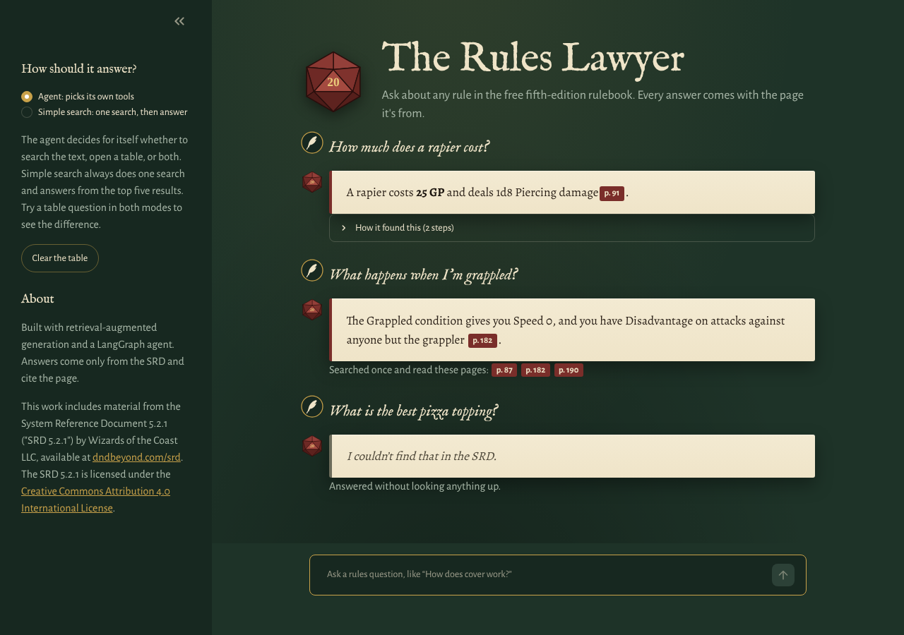
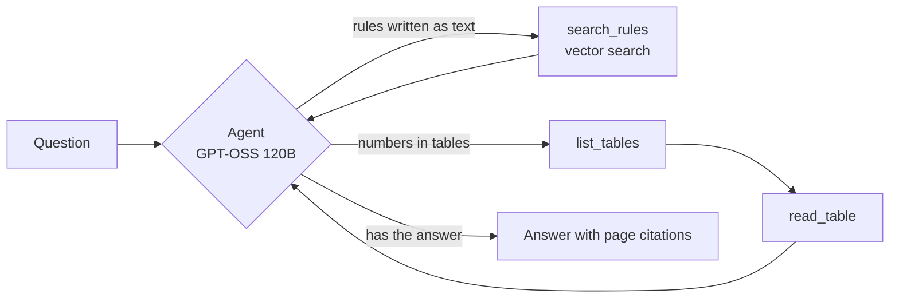

<p align="center">
  
</p>

<h1 align="center">The Rules Lawyer</h1>

<p align="center">
  A D&D rules assistant built with retrieval-augmented generation and a LangGraph agent.<br>
  Ask a rules question and get a short answer with the page it came from.
</p>

<p align="center">
  
</p>

## What it does

The Rules Lawyer answers questions about the free fifth-edition rules (the System Reference Document 5.2.1, 364 pages). Every answer cites its page, and when the rules don't cover something it says so instead of guessing.

There are two ways to answer, and the page lets you switch between them:

- **Simple search:** one meaning-based search over the rulebook, then the model answers from the top five results. This is classic RAG.
- **Agent:** the model gets three tools and decides for itself which to use, in what order, and when it has enough to answer.

The app shows the agent's steps under each answer, so you can see why it answered the way it did.

## How it works



**1. Parsing** (`01_ingest.py`). The SRD is a two-column PDF full of tables. A naive text extraction mixes the two columns and turns every table cell into its own line, so `Longsword | 1d8 Slashing` becomes two unrelated lines. I convert each page to Markdown with `pymupdf4llm`, which keeps the reading order and the table rows intact.

**2. Chunking.** Instead of cutting every N characters, chunks follow the document's own structure:
- every chunk starts with its section path, e.g. `[Wizard > Level 1: Spellcasting]`, so a chunk about spell slots still says which class it belongs to
- tables are never cut in the middle; a big table is split by rows with the header repeated on every piece

The result is 3,618 chunks, 361 of which contain a table.

**3. Embeddings and vector store** (`02_index.py`). Each chunk is embedded with `BAAI/bge-small-en-v1.5`, which runs locally, and stored in ChromaDB with its page and section.

**4. Grounded answers** (`04_ask.py`). The model may only use the retrieved sources, must cite a page after each fact, and must say *"I couldn't find that in the SRD"* when the sources don't contain the answer.

**5. The agent** (`06_agent.py`). A LangGraph graph with an agent node and a tool node in a loop. The tools are:

| Tool | Use |
|---|---|
| `search_rules` | Meaning-based search over the rules text |
| `list_tables` | Find a table by name, e.g. "weapon" |
| `read_table` | Read matching rows from that table, e.g. "Rapier" |

The table tools read from a table store (`tables.py`) rebuilt from the chunks: 329 tables, each with its header and rows.

## Results

I wrote a test set of 12 questions with known answers and pages (`evals/questions.json`): 10 the SRD answers, and 2 it doesn't, to check that the system refuses instead of answering from memory. `05_eval.py` scores retrieval and answers separately.

| | Simple search (RAG) | Agent |
|---|---|---|
| Correct answers | 8 / 12 | **12 / 12** |
| Table questions (4) | 0 / 4 | 4 / 4 |
| Other questions (6) | 6 / 6 | 6 / 6 |
| Correct refusals (2) | 2 / 2 | 2 / 2 |

Every failure of the simple pipeline was a table question. Meaning-based search is good at rules written as sentences and bad at tables, which are mostly numbers and short labels. Giving the agent a direct way to read tables fixed all four without breaking anything else.

**A caution about these numbers:** I built the table tools after seeing which questions failed, so the agent is partly tuned to this test set. The next step is a second set of questions written after the fact, which gives a fairer score.

## What I learned from the failures

**A citation doesn't make an answer correct.** Asked how much damage a longsword does, the simple pipeline answered *"2d10 + 1, page 299"*. The correct answer is 1d8. Search never found the weapons table, only a hobgoblin stat block that happens to use a longsword, and the model faithfully answered from that. It followed every rule and was still wrong. Most RAG errors are retrieval errors, not model errors.

**Parsing decides everything downstream.** My first extraction split tables into one value per line, and the numbers lost their labels. No later step can recover from that.

**A coarse metric hides problems.** My first retrieval metric only checked the page number. One question scored as found, but the chunk on that page only mentioned the table without containing it. The model refused correctly, and the metric was what was wrong.

**Evals have bugs too.** One answer was marked wrong because the model wrote "8 hours" with a narrow no-break space. Reading the actual outputs before trusting a score caught it.

## Run it yourself

```bash
git clone https://github.com/krish26/RAG_Agent.git
cd RAG_Agent
python -m venv .venv
.venv\Scripts\activate          # macOS/Linux: source .venv/bin/activate
pip install -r requirements.txt
```

1. Download the SRD 5.2.1 PDF from [dndbeyond.com/srd](https://www.dndbeyond.com/srd) and save it as `data/srd.pdf`.
2. Get a free API key at [console.groq.com](https://console.groq.com) and put it in a `.env` file (see `.env.example`).
3. Build the index and start the app:

```bash
python 01_ingest.py data/srd.pdf    # a few minutes
python 02_index.py                  # a few minutes
streamlit run app.py
```

To run the evaluation:

```bash
python 05_eval.py --retrieval-only   # free, no API calls
python 05_eval.py                    # simple search
python 05_eval.py --agent            # agent
```

## Built with

Python, LangGraph, ChromaDB, sentence-transformers (`bge-small-en-v1.5`), pymupdf4llm, Groq (GPT-OSS 120B), Streamlit. Everything runs on free tiers.

## What's next

- A second, unseen test set for a fairer score
- Fix monster stat blocks, which currently lose the monster's name and garble the ability scores
- A dice and maths tool, for questions like "what's the average damage of a greatsword?"
- A reranker, so the best chunk ranks first rather than fifth

## Licence and attribution

This work includes material from the System Reference Document 5.2.1 ("SRD 5.2.1") by Wizards of the Coast LLC, available at https://www.dndbeyond.com/srd. The SRD 5.2.1 is licensed under the [Creative Commons Attribution 4.0 International License](https://creativecommons.org/licenses/by/4.0/legalcode).

This is an unofficial fan project and is not affiliated with or endorsed by Wizards of the Coast. The d20 and quill images are original drawings made for this project.
